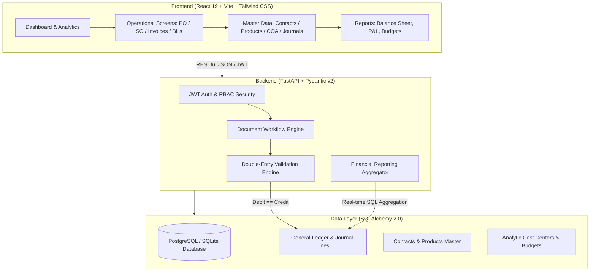

# 🏢 Urban Furniture Accounting System

> **A production-grade, double-entry accounting and financial ERP system designed specifically for the Urban Furniture enterprise workflow.**  
> Built with FastAPI, SQLite / PostgreSQL, React 19, Tailwind CSS, and Recharts.

---

## 📖 Executive Summary & Description

The **Urban Furniture Accounting System** is a unified financial management solution engineered to solve end-to-end accounting challenges in modern furniture retail, manufacturing, and distribution operations. 

It strictly enforces the foundational principle of **Double-Entry Bookkeeping**: every financial event generates balancing ledger entries (`Total Debit == Total Credit`), ensuring zero discrepancy between operations and reporting. The system automatically converts commercial transactions—such as **Purchase Orders** into **Vendor Bills** and **Sales Orders** into **Customer Invoices**—into journal entries while recording multi-method payments through Bank and Cash journals.

In addition to core ledgers, the platform includes **Analytic Accounting & Cost Centers**, enabling furniture business owners and accountants to establish budget targets for initiatives (such as *Showroom Expansion*, *Marketing Campaigns*, or *Woodworking Machinery*) and track real-time planned vs. actual expenditure variance.

---

## 👥 Contributors & Core Team

| Contributor | GitHub Handle | Core Responsibility |
|---|---|---|
| **Aakash Jayani** | [@aakashjayani19352-wq](https://github.com/aakashjayani19352-wq) | **Full-Stack Lead & Integration**: Complete frontend UI/UX, 19 interactive screens & modals, Recharts dashboards, API client, repository architecture & integration. |
| **Chandan Shah** | [@chandan-shah226]([(https://github.com/chandan-shah226)) | **Backend Core & Architecture**: FastAPI application setup, SQLite/PostgreSQL database models, RESTful endpoints, seed data engine, JWT authentication & RBAC. |
| **Rudra Patel** | [@rudraop922](https://github.com/rudraop922) | **Ledger & Accounting Engine**: Double-entry journal entry generation, transactional integrity validation, automated document posting workflows, and testing suites. |

---

## 🏛️ System Architecture



---

## 🌟 Key Features & Problem Statement Fulfillment

### 1. Master Data Management
- **Contact Master**: 
  - Complete management of Customers, Vendors, and Both.
  - Granular details: addresses, GST/Tax info, email, phone, city, state, and zip code.
  - Role-based privacy filters ensure customers only view their own transactional history.
- **Product Master**:
  - Support for **Goods** (stockable furniture like desks, chairs, sofas), **Services** (assembly, interior consultation), and **Combo** packages.
  - Automated unit profit margin calculations based on cost price vs. sales price.
- **Chart of Accounts (COA)**:
  - Full hierarchical classification: **Assets**, **Liabilities**, **Capital / Equity**, **Income**, and **Expenses**.
  - Strict account code indexing.
- **Financial Journals**:
  - Segregated journal books: **Sales Journal**, **Purchase Journal**, **Bank Journal**, **Cash Journal**, and **General Journal**.

### 2. Transaction Flow & Double-Entry State Machine
- **Procure to Pay (P2P)**:
  1. Create **Purchase Order** (`Draft`) with vendor, line items, unit costs, and taxes.
  2. **Convert to Vendor Bill** (`Billed`): Automatically validates and generates a balanced general ledger entry:
     - `Debit`: Purchase Expense / Cost of Goods Sold
     - `Credit`: Accounts Payable
  3. **Register Payment** (`Paid`) via Bank or Cash:
     - `Debit`: Accounts Payable
     - `Credit`: Bank or Cash
- **Order to Cash (O2C)**:
  1. Create **Sales Order** (`Draft`) with customer, product selection, pricing, and taxes.
  2. **Generate Customer Invoice** (`Invoiced`): Automatically validates and posts:
     - `Debit`: Accounts Receivable
     - `Credit`: Sales Revenue / Tax Payable
  3. **Receive Payment** (`Paid`) via Bank or Cash:
     - `Debit`: Bank or Cash
     - `Credit`: Accounts Receivable
- **General Ledger & Manual Journal Entries**:
  - Comprehensive audit trail of all journal entries and debit/credit line legs.
  - Interactive **Manual Journal Entry Creator** with real-time dynamic debit/credit balancing verification (`Debit == Credit` requirement).

### 3. Analytic Accounts & Cost Center Budgeting
- Tag transactions with specific **Analytic Accounts** (e.g. *Showroom Upgrade*, *Digital Marketing*, *Logistics*).
- Define planned budget allocations for financial periods with assigned managers.
- Real-time **Planned vs. Actual** expenditure analysis with percentage achievement calculations.

### 4. Interactive Financial Reports & Visual Dashboards
- **Executive Dashboard**: Key performance indicators (Total Revenue, Total Purchases, Net Profit, Contact counts) with quick-action creation shortcuts.
- **Balance Sheet**:
  - Equation: **Assets = Liabilities + Equity + Current Net Profit**.
  - Interactive composition donut and pie charts powered by Recharts.
  - Detailed balance sheets broken down by account categories.
- **Profit & Loss (P&L)**:
  - Real-time calculation of Gross Revenue, COGS, and Operating Expenses.
  - Visual expense breakdown charts and revenue comparisons.
- **Budget Performance Report**:
  - Recharts bar chart tracking budget allocation vs. actual ledger expense per analytic account.

---

## 🖥️ Screen & UI Inventory (19 Screens & Modals)

| # | Screen / View | Description |
|---|---|---|
| 1 | **Sign In / Auth** | Email & Password authentication with 1-click Quick Demo login buttons. |
| 2 | **Dashboard Overview** | Executive summary cards, financial health gauges, and quick action bar. |
| 3 | **Contacts List** | Directory of customers and vendors with type badges, contact info, and search. |
| 4 | **Contact Detail & Edit** | Form for creating or modifying customer/vendor billing details. |
| 5 | **Products Catalog** | Visual product cards and table displaying type, price, cost, and margin. |
| 6 | **Product Detail & Edit** | Form for creating goods, services, and combos with auto-margin calculator. |
| 7 | **Chart of Accounts** | Categorized list of Asset, Liability, Equity, Income, and Expense accounts. |
| 8 | **Account Detail & Edit** | Form for adding or customizing financial ledger accounts. |
| 9 | **Financial Journals** | Dedicated journal books (Sales, Purchase, Bank, Cash, General). |
| 10 | **Journal Detail & Edit** | Configuration form for journal types and default debit/credit accounts. |
| 11 | **Purchase Orders List** | Purchase orders with lifecycle status tags (`Draft`, `Billed`, `Paid`). |
| 12 | **New Purchase Order** | Multi-item purchase order generator with vendor and tax inputs. |
| 13 | **Sales Orders List** | Sales orders tracking customer furniture orders through invoicing. |
| 14 | **New Sales Order** | Sales order creator with dynamic price calculation and tax computation. |
| 15 | **Journal Entries Ledger** | Audit log of all double-entry journal entries and debit/credit legs. |
| 16 | **Manual Journal Entry Modal** | Real-time balancing entry creator with dynamic validation feedback. |
| 17 | **Balance Sheet** | Live statement of financial position with visual composition charts. |
| 18 | **Profit & Loss Statement** | Income, expense, and net profit report with expenditure breakdowns. |
| 19 | **Budget Report** | Analytic cost center planned vs. actual performance tracker with charts. |

---

## 🔐 Pre-seeded Demo Credentials

The database automatically seeds on startup with demo data and three distinct role accounts:

| Role | Email | Password | Permissions & Access Scope |
|---|---|---|---|
| **Admin (Business Owner)** | `admin@urbanfurniture.com` | `admin123` | Full access to all modules, financial reports, user management, and system settings. |
| **Accountant (Invoicing User)** | `accountant@urbanfurniture.com` | `accountant123` | Create & manage master data, record orders, generate bills/invoices, post payments, view reports. |
| **Customer / Vendor Portal** | `customer@tejas.com` | `customer123` | Limited access: view own account details, invoices, bills, and payment status. |

---

## ⚡ Quickstart Guide

### Prerequisites
- **Python 3.10+**
- **Node.js 18+** and **npm**

### 1. Backend Setup (FastAPI)

```bash
# Navigate to backend directory
cd backend

# Install dependencies
pip install -r requirements.txt

# Run the API server
python run.py
```
- **Backend API**: `http://localhost:8000`
- **Interactive Swagger Documentation**: `http://localhost:8000/docs`
- *Note*: The backend seamlessly defaults to an automated SQLite database (`urban_accounting.db`) if PostgreSQL is not configured, requiring zero external database configuration for local evaluation.

### 2. Frontend Setup (React + Vite)

```bash
# Navigate to frontend directory
cd frontend

# Install node dependencies
npm install

# Start the Vite development server
npm run dev
```
- **Frontend Application**: `http://localhost:5173`

---

## 🧪 Automated Testing Suite

The accounting core includes automated tests validating double-entry constraints and document flows:

```bash
cd backend
pytest tests/test_accounting.py -v
```

### Verified Test Cases:
1. `test_unbalanced_journal_entry_rejection`: Asserts that an unbalanced transaction (`Debit != Credit`) raises an HTTP 400 validation error and rolls back database changes.
2. `test_sale_purchase_payment_flow_and_reports`: Tests document creation, payment settlement, and verifies accurate Balance Sheet and P&L calculations.
3. `test_purchase_order_to_bill_and_payment_flow`: Validates PO creation → Convert to Vendor Bill → Register Payment lifecycle.
4. `test_sales_order_to_invoice_and_payment_flow`: Validates SO creation → Generate Customer Invoice → Receive Payment lifecycle.

---

## 📄 License

Developed for the Urban Furniture Accounting System Hackathon. All rights reserved by the development team (Aakash Jayani, Chandan Shah, and Rudra Patel).
